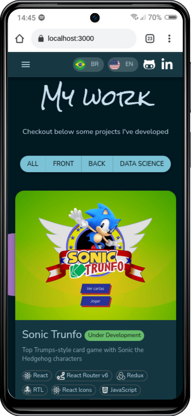

# :necktie: Portfolio

## :page_with_curl: About/Sobre

  
<strong>:us: English</strong>
 

My personal portfolio. Developed with React and Material UI.

[Click here](https://raphaelalmeidamartins.github.io/) to check out the final version of the project on your browser.
 

  
<strong>:brazil: Português</strong>
 

Meu portfólio pessoal. Desenvolvido em React e Material UI.

[Clique aqui](https://raphaelalmeidamartins.github.io/) para conferir a versão final do projeto no seu navegador.
 

## :man_technologist: Developed Skills/Habilidades Desenvolvidas

  
<strong>:us: English</strong>
 

* Develop a React application using the Material UI framework
 

  
<strong>:brazil: Português</strong>
 

* Desenvolver uma aplicação React com o Material UI framework
 

## :memo: Methodologies/Metodologias

* Mobile First

## :hammer_and_wrench: Tools/Ferramentas

* HTML5
* CSS3
* Material UI
* JavaScript ES6+
* React.js
* React Icons (icon library)
* GitHub Pages

## :iphone: Mobile version/Versão mobile

